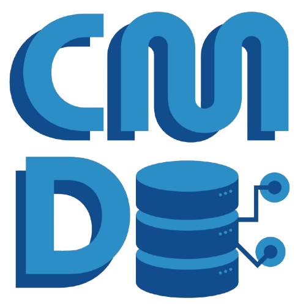

<p align="center">
  
</p>

<h1 align="center">CMDB System - IT Asset Registry</h1>

<p align="center">
  <a href="#project-title">Project Title</a> •
  <a href="#features">Features</a> •
  <a href="#user-roles">User Roles</a> •
  <a href="#how-it-works">How It Works</a> •
  <a href="#installation">Installation</a> •
  <a href="#requirements">Requirements</a> •
  <a href="#support">Support</a>
</p>

---

## Project Title

The **CMDB System - IT Asset Registry** is a full-stack Configuration Management Database (CMDB) web application built with **React + TypeScript** (frontend) and **Laravel 12** (backend). It provides a centralized IT Asset Registry for managing all Configuration Items (CIs), their relationships, status, and change history - aligned with ISO 27001:2022 and ITIL 4 practices.

- Centralized registry for all IT assets and configuration items
- Accurate and up-to-date records of hardware, software, cloud services, and databases.
- Full audit trail with automated change logging
- Secure token-based authentication via Laravel Sanctum
- Clean, responsive UI built with Mantine component library

---

## Features

<details>
<summary><strong>Click to expand features</strong></summary>

- Secure login and session management with Sanctum Bearer tokens
- Dashboard with CI category summary, status, CMDB Overview, Workbook Navigation, and Recent Change log feed
- Full CRUD management for 6 CI types: Servers, Network Devices, Endpoints, Software, Cloud Services, and Databases
- Inline and grid editable table cells with type-aware inputs (text, number, date, select, boolean)
- Soft delete with archive and restore support
- CI Relationship Register - map dependencies between any two CIs with relationship type and criticality
- CI Change Log - paginated audit log with expandable field-level diff view
- Reference / Lookup Tables - editable classification tables (CI Status, Criticality, Environments, Data Classification, Relationship Types)
- Collapsible sidebar navigation with tooltips
- User profile editing (display name update)
- Search, filter, sort, and pagination across all CI tables
- Automatic CI name auto-fill when entering a CI ID in the Relationships form
- Notifications for save, update, and delete operations

</details>

---

## User Roles
 
| Role | Description |
|------|-------------|
| **User** | Full access to all CI records - can view, add, edit, delete, archive, and restore all configuration items, relationships, reference tables, and change logs |
 
---

## How It Works

1. User logs in via the Login page - a Sanctum token is stored in `localStorage`
2. The token is automatically attached to every API request via an Axios interceptor
3. The Sidebar lets users navigate between CI modules, relationships, change log, and reference tables
4. Each CI module uses the shared `CITable` component - a generic, reusable table that handles list, create, edit, delete, restore, and archive
5. Every create/update/delete action on the backend triggers the `CiObserver`, which records a detailed change log entry
6. The Change Log page displays all recorded changes with an expandable diff showing previous vs. new field values
7. The Dashboard aggregates live stats from the backend and displays the 5 most recent changes
8. The Reference page allows users to manage lookup/classification data used across all CI forms

---

## Process Flow


---

## Installation

### Prerequisites

Make sure the following tools are installed before you begin:

| Tool | Version | Download |
|------|---------|----------|
| PHP | ^8.2 | https://www.php.net/downloads |
| Composer | Latest | https://getcomposer.org |
| Node.js | ^18.x or ^20.x | https://nodejs.org |
| npm | ^9.x or ^10.x | Bundled with Node.js |
| Git | Latest | https://git-scm.com |

---

### Backend Setup (Laravel 12)

#### Step 1 - Clone the Repository

```bash
git clone https://gitcode.suhay.com.ph/SuhayOPC/cmdb.git
cd cmdb/backend
```

#### Step 2 - Install PHP Dependencies via Composer

```bash
composer install
```

Installs the following core packages:

| Package | Version | Purpose |
|---------|---------|---------|
| `laravel/framework` | ^12.0 | Core Laravel framework |
| `laravel/sanctum` | ^4.0 | API token authentication |
| `laravel/tinker` | ^2.10 | REPL / debugging tool |

#### Step 3 - Configure Environment

```bash
cp .env.example .env
php artisan key:generate
```

Open `.env` and set your environment values. Default uses **SQLite** (no database server needed):

```env
APP_NAME=AssetHub
APP_ENV=local
APP_URL=http://localhost:8000

DB_CONNECTION=sqlite

SANCTUM_STATEFUL_DOMAINS=localhost:5173
SESSION_DOMAIN=localhost
```

> To switch to **MySQL**, set `DB_CONNECTION=mysql` and fill in `DB_HOST`, `DB_PORT`, `DB_DATABASE`, `DB_USERNAME`, and `DB_PASSWORD`.

#### Step 4 - Run Database Migrations

```bash
php artisan migrate
```

Creates all tables: `users`, `servers`, `network_devices`, `endpoints`, `software`, `cloud_services`, `cmdb_databases`, `ci_relationships`, `ci_change_logs`, `personal_access_tokens`, and more.

To reset and re-run all migrations from scratch:

```bash
php artisan migrate:fresh
```

#### Step 5 - Start the Laravel API Server

```bash
php artisan serve
```

The API will be available at `http://localhost:8000/api`.

---

### Frontend Setup (React + Vite + TypeScript)

#### Step 6 - Navigate to the Frontend Directory

```bash
cd ../frontend
```

#### Step 7 - Install Node.js Dependencies via npm

```bash
npm install
```

Install the following key packages:

| Package | Version | Purpose |
|---------|---------|---------|
| `react` | ^18 | UI framework |
| `react-dom` | ^18 | DOM rendering |
| `typescript` | ^5 | Type-safe JavaScript |
| `vite` | ^5 | Frontend build tool & dev server |
| `@vitejs/plugin-react` | ^4 | React support for Vite |
| `@mantine/core` | ^7 | UI component library |
| `@mantine/notifications` | ^7 | Toast notification system |
| `@mantine/modals` | ^7 | Modal manager |
| `@tabler/icons-react` | Latest | Icon library used throughout the UI |
| `axios` | ^1 | HTTP client for API requests |
| `recharts` | ^2 | Bar chart on the Dashboard |
| `@tanstack/react-query` | ^5 | Server state management and data fetching |
| `react-router-dom` | ^6 | Client-side routing and navigation |
| `react-hook-form` | ^7 | Form state management and validation |

#### Step 8 - Configure the Environment

Create a `.env` file in the frontend root:

```env
VITE_API_URL=http://localhost:8000/api
```

> This tells the Axios client where to send all API requests. Make sure this matches your Laravel server URL.

#### Step 9 - Start the Development Server

```bash
npm run dev
```

The app will be available at `http://localhost:5173`.

#### Step 10 - Build for Production

```bash
npm run build
```

Output will be generated in the `dist/` folder, ready to be served by any static file host or web server (Apache, Nginx, etc.).

---

### Running Both Together (Optional)

From the backend directory, you can use the built-in `composer dev` script to start the Laravel server, queue worker, log watcher, and Vite simultaneously:

```bash
composer run dev
```

---

## System Requirements

### Software

| Tool | Description |
|------|-------------|
| PHP 8.2+ | Backend runtime for Laravel |
| Composer | PHP dependency manager |
| Node.js 18+ | Frontend runtime and build tooling |
| npm 9+ | Node package manager |
| VS Code | Recommended code editor |
| Git | Version control |
| XAMPP / Laragon | Optional local Apache/MySQL server |

### Recommended Browsers

| Browser |
|---------|
| Google Chrome |
| Mozilla Firefox |
| Microsoft Edge |

### Hardware

| Component | Specification |
|-----------|---------------|
| OS | Windows Server 2019 or later / Ubuntu 20.04+ |
| Processor | Intel Core i5 / Xeon E5-2630 or equivalent |
| Memory | 8GB RAM minimum (16GB recommended) |
| Storage | 100GB SSD minimum |
| Network | Standard LAN / Wi-Fi |
| Power Supply | 600W (for server deployments) |

---

## Support

For support, email info@suhay.com.ph or visit [www.suhay.com.ph](http://www.suhay.com.ph)

---